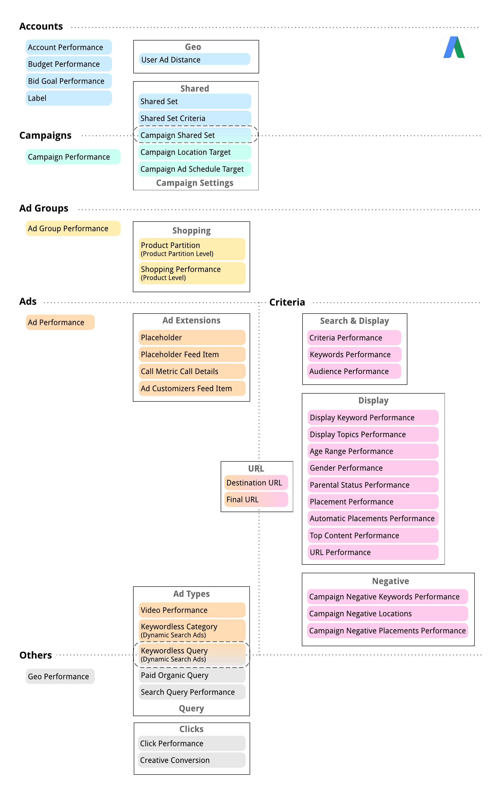

## Google Ads Python Script

### The idea is to have a couple scripts that can start up an entire google ads account and manage basic operations

### This python script will 
- Read campaign names from a list or Google Sheet
- Generate keywords using the Google Keywords Planner API
- Add keywords to a Google Sheet 
- Create Campaigns
- Create keyword variants
- Add Ad Groups to Campaigns
- Add keywords to the Ad Groups
- 

# Getting Started
### Google Sheets Setup
1. Go to your [Google Developers Console](https://console.developers.google.com/)
2. Create a new project
3. Select your new project once it is created, (It may take a few seconds for Google to create your project)
4. Enable the Google Drive API
5. Click on "add credentials"
6. Select "Web server"
7. Select "Application data"
8. Select "No, I'm not using them"
9. Create a service account with a role of "Project" -> "Editor"
10. Download the JSON credentials file and save as "client_secret.json"
11. Copy the "client_email" from "client_secret.json" and share that email with your google sheet
12. Enable the Google Sheets API

